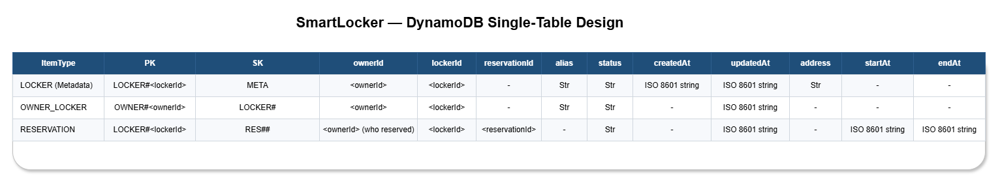

# Single-Table Design (Core Pattern) — SmartLocker Domain

This document introduces the **Single-Table Core Pattern** using the SmartLocker domain.
It defines the domain, enumerates concrete access patterns, and proposes a first-pass
single-table schema to validate those access patterns.

---

## Domain: SmartLocker

The system manages physical lockers that belong to an **owner** (user or organization).
Lockers can be reserved, accessed (open/close), and audited through immutable events.

### Assumptions

- **One owner can have many lockers (1 → N)**.
- A locker has a unique identifier: `lockerId`.
- We need **fast reads** for:
  - locker metadata/state
  - lockers by owner
  - reservations and access logs by locker (time-ordered)

---

## Access Patterns

Access patterns are expressed as **query contracts**.
Each one specifies required keys, ordering needs, and expected scale.

### AP-01 — Get locker by lockerId
- **Goal:** Fetch a single locker’s metadata/state
- **Operation:** `GetItem`
- **Keys:** `PK + SK`
- **Frequency:** High

### AP-02 — List lockers for an owner
- **Goal:** Show all lockers owned by a given ownerId
- **Operation:** `Query`
- **Ordering:** Optional (by lockerId or alias)
- **Frequency:** High

### AP-03 — Update locker state (optimistic concurrency)
- **Goal:** Change a locker state safely (AVAILABLE/OCCUPIED/MAINTENANCE)
- **Operation:** `UpdateItem` with condition
- **Keys:** `PK + SK`
- **Notes:** Use `version` or `updatedAt` for concurrency control

### AP-04 — Create reservation for a locker
- **Goal:** Create a reservation window for a specific locker
- **Operation:** `PutItem` (optionally conditional)
- **Keys:** `PK + SK`
- **Notes:** Time-based sort key enables range queries

### AP-05 — List reservations for a locker (time range)
- **Goal:** Fetch reservations for a locker within a time window
- **Operation:** `Query`
- **Ordering:** By start timestamp (ascending or descending)
- **Frequency:** Medium

### AP-06 — Get active reservation for a locker (now)
- **Goal:** Identify whether the locker currently has an active reservation
- **Operation:** `Query` (bounded) or `GetItem` if materialized
- **Notes:** Often best served by a **materialized “ACTIVE” pointer item**

---

## Single-Table Schema (First Pass)

We store multiple entity types in a single table using a shared PK/SK namespace.

### Key conventions

- Partition keys group related items:
  - `LOCKER#<lockerId>` groups all locker-related data
  - `OWNER#<ownerId>` groups the owner’s locker references
- Sort keys differentiate entity types and enforce ordering:
  - `META`, `STATE`, `RES#<startISO>#<reservationId>`, `EVT#<timestampISO>#<eventId>`

---

## Item Types

### 1) Locker Metadata (canonical record)

**Keys**
- `PK = LOCKER#<lockerId>`
- `SK = META`

**Attributes (example)**
- `entityType = "LOCKER"`
- `lockerId`
- `ownerId`
- `status` (AVAILABLE/OCCUPIED/MAINTENANCE)
- `locationId` (optional)
- `createdAt`, `updatedAt`
- `version` (for optimistic concurrency)

---

### 2) Owner → Locker relationship (materialized view)

This replaces the need for a GSI on `ownerId` by materializing ownership as items.

**Keys**
- `PK = OWNER#<ownerId>`
- `SK = LOCKER#<lockerId>`

**Attributes (example)**
- `entityType = "OWNER_LOCKER"`
- `ownerId`
- `lockerId`
- `lockerAlias` (optional display name)
- `status` (optional denormalized copy for fast list views)
- `updatedAt`

> This pattern explicitly supports **one owner → many lockers** by storing many items under `PK=OWNER#<ownerId>`.

---

### 3) Reservation (time-ordered per locker)

**Keys**
- `PK = LOCKER#<lockerId>`
- `SK = RES#<startISO>#<reservationId>`

**Attributes (example)**
- `entityType = "RESERVATION"`
- `reservationId`
- `ownerId` (who reserved)
- `startAt`, `endAt`
- `status` (ACTIVE/CANCELLED/EXPIRED)

---

### 4) Active Reservation Pointer (optional but recommended)

If “active reservation” is frequently needed, avoid scanning a time window by storing a pointer.

**Keys**
- `PK = LOCKER#<lockerId>`
- `SK = RES#ACTIVE`

**Attributes (example)**
- `entityType = "RESERVATION_ACTIVE"`
- `reservationId`
- `ownerId`
- `startAt`, `endAt`
- `updatedAt`

---

### 5) Access Event (audit log, time-ordered per locker)

**Keys**
- `PK = LOCKER#<lockerId>`
- `SK = EVT#<timestampISO>#<eventId>`

**Attributes (example)**
- `entityType = "ACCESS_EVENT"`
- `eventId`
- `timestamp`
- `action` (OPEN/CLOSE/DENIED/etc.)
- `actorId` (user/system)
- `result` (SUCCESS/FAIL)
- `metadata` (optional map)

---

## Validation: Access Patterns → Queries

Below are the query contracts that validate the schema.

### AP-01 — Get locker by lockerId
- `GetItem(PK=LOCKER#<lockerId>, SK=META)`

### AP-02 — List lockers for an owner
- `Query(PK=OWNER#<ownerId>, SK begins_with "LOCKER#")`

### AP-03 — Update locker state (optimistic concurrency)
- `UpdateItem(PK=LOCKER#<lockerId>, SK=META)`
- Condition: `version = :expectedVersion` (then increment)

### AP-04 — Create reservation for a locker
- `PutItem(PK=LOCKER#<lockerId>, SK=RES#<startISO>#<reservationId>)`
- (Optional) also upsert `RES#ACTIVE` if it becomes the active reservation

### AP-05 — List reservations for a locker (time range)
- `Query(PK=LOCKER#<lockerId>, SK between "RES#<startISO>" and "RES#<endISO>~")`

### AP-06 — Get active reservation for a locker
- Preferred: `GetItem(PK=LOCKER#<lockerId>, SK=RES#ACTIVE)`
- Alternative: `Query(PK=LOCKER#<lockerId>, SK begins_with "RES#")` + bounded filter logic

## Pagination and Result Limits (Operational Notes)

- All `Query` operations are paginated. Always handle `LastEvaluatedKey` and return a `nextCursor` to clients.
- Prefer bounded page sizes (e.g., 25–100) to control latency and cost.
- Use `Limit` for “latest N” use cases (e.g., access events) and avoid unbounded reads.

---

## Notes and Trade-offs

- This design minimizes GSIs by materializing read models (`OWNER#...`) inside the table.
- Reservations is naturally time-ordered using the sort key.
- If lockers can change owners, the system must update:
  - `LOCKER#<lockerId>/META.ownerId`
  - remove old `OWNER#<oldOwnerId>/LOCKER#<lockerId>`
  - create new `OWNER#<newOwnerId>/LOCKER#<lockerId>`

---

## What’s next

The schema above is a first-pass design.
Next, we formalize each access pattern as a strict **query contract** (keys, ordering, pagination,
expected cardinality, and cost considerations), and decide whether any GSIs are truly required.

➡️ See next: `dynamodb/02-access-patterns.md`
