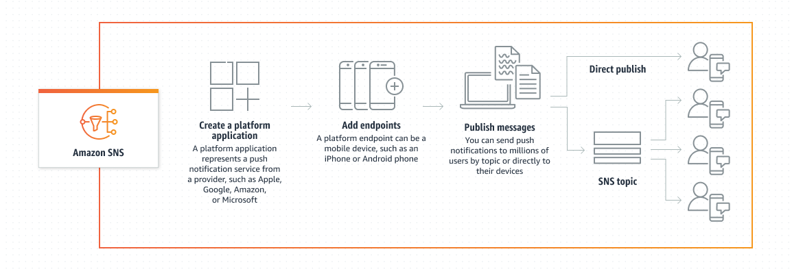

# Mobile Push Architecture with Amazon SNS

## 1. Problem Context

Mobile applications require reliable real-time communication
to notify users about:

- Device alerts
- Status changes
- Security notifications
- User-specific events

Direct integration with platform providers (APNS / FCM)
introduces operational complexity, platform-specific logic,
and credential management overhead.

A unified backend push architecture is required.

---

## 2. Architectural Overview

Mobile push systems using Amazon SNS follow this high-level lifecycle:

Backend → SNS Platform Application → Platform Endpoint → Device (APNS / FCM)

### Push Lifecycle Overview

This flow highlights several important architectural layers:

- **Platform Application**  
  Represents push provider credentials (APNS / FCM).

- **Platform Endpoint**  
  Represents a specific mobile device instance.

- **Publish Operation**  
  Can target:
  - A specific device (TargetArn)
  - A topic for broadcast delivery

SNS abstracts direct communication with APNS and FCM,
providing a unified push interface across platforms.

---

## 3. Core Publishing Patterns

### 3.1 Direct-to-Endpoint Publishing

Publishing directly to a TargetArn:

Backend → SNS Publish(TargetArn)

Use Cases:

- User-specific notifications
- Device alerts
- Personalized events

Advantages:

- Fine-grained targeting
- Clear device-level control

Trade-offs:

- Requires endpoint lifecycle management
- Requires token refresh handling

Interview Insight:

> In production systems, direct publishing is preferred for user-specific
> device alerts where precision and low latency are required.

---

### 3.2 Topic-Based Push Publishing

Publishing to a topic:

Backend → SNS Topic → Multiple Endpoints

Use Cases:

- Broadcast alerts
- System-wide announcements
- Marketing notifications

Advantages:

- Horizontal scalability
- Simplified publishing logic

Trade-offs:

- Requires segmentation strategy
- Reduced per-device control

Interview Insight:

> Topic-based publishing is useful when event fan-out is more important
> than per-device precision.

---

## 4. Endpoint Lifecycle Management

Mobile push reliability depends on correct endpoint management.

### 4.1 Token Registration Flow

1. Mobile app retrieves device token from APNS / FCM.
2. Mobile app sends token to backend.
3. Backend:
   - Creates or updates SNS Platform Endpoint.
   - Stores TargetArn in database associated with userId or deviceId.

Key Considerations:

- Handle token refresh events.
- Avoid duplicate endpoint creation.
- Maintain one active TargetArn per device.

Interview Insight:

> One of the most common reliability issues in push systems
> is improper token lifecycle management rather than SNS itself.

---

### 4.2 Handling Endpoint Disabled

EndpointDisabled typically occurs when:

- The app is uninstalled.
- The device token expires.
- The provider rejects the token.

Recommended Strategy:

- Monitor delivery failure events.
- Detect EndpointDisabled responses.
- Mark endpoint inactive in database.
- Require re-registration on next login.

This prevents repeated publish failures and unnecessary retries.

Interview Insight:

> In real systems, endpoint disablement trends often indicate
> token refresh mismanagement or uninstall behavior patterns.

---

## 5. Payload Design Considerations

Push payloads must be platform-specific.

SNS supports multi-platform message structures:

{
  "default": "Fallback message",
  "GCM": "...",
  "APNS": "..."
}

Best Practices:

- Keep payload small.
- Avoid sensitive data.
- Use message attributes for segmentation.
- Do not rely solely on push delivery for critical workflows.

Interview Insight:

> Push notifications should be treated as event signals,
> not as a guaranteed delivery channel.

---

## 6. Reliability Characteristics

SNS provides:

- At-least-once delivery
- Provider-managed retries
- High availability across AZs

Implications:

- Duplicates are possible.
- Delivery success does not guarantee user interaction.
- Idempotency must be implemented in backend logic.

Interview Insight:

> SNS guarantees delivery to the provider, not user engagement.
> Business workflows should not depend solely on push confirmation.

---

## 7. Observability Strategy

Mobile push systems require active monitoring.

Key Signals:

- Publish success rate
- Delivery failure rate
- EndpointDisabled events
- Platform-specific error distribution

Monitoring should include:

- CloudWatch metrics
- Structured logs
- Alert thresholds

Production Insight:

Endpoint disablement spikes can indicate:

- Certificate expiration
- Token lifecycle bugs
- Mobile app release issues

---

## 8. Scalability Considerations

SNS scales horizontally by design.

However:

- Endpoint database lookups must scale.
- Token registration must be idempotent.
- Broadcast strategies should use topic segmentation.

Large-scale systems should avoid:

- Synchronous validation flows.
- Publishing without endpoint state validation.

---

## 9. Security Considerations

- Restrict SNS Publish via IAM.
- Protect APNS / FCM credentials.
- Validate user identity before associating TargetArn.
- Encrypt sensitive device metadata.

---

## 10. Architectural Trade-offs

SNS simplifies mobile push architecture by abstracting:

- Provider communication
- Retry mechanisms
- Multi-platform integration

However:

- It requires endpoint lifecycle ownership.
- It does not guarantee user-level delivery.
- It does not provide advanced analytics.

Architectural decisions must balance operational simplicity,
control, and reliability requirements.